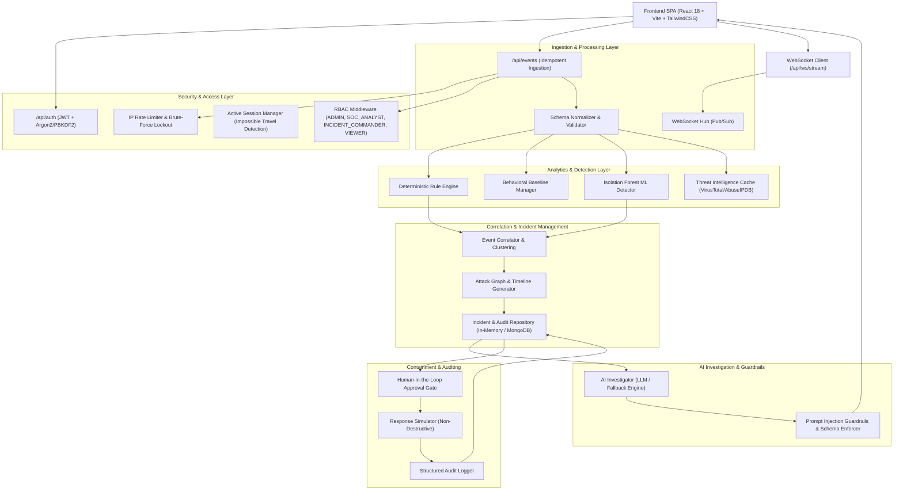

# AI-CyberGuard — System Architecture & Design Specification

AI-CyberGuard is an enterprise-grade, autonomous cybersecurity detection, incident correlation, and AI-assisted investigation platform. It implements a non-destructive SOC investigation pipeline where AI assists human analysts by explaining evidence, formulating root cause hypotheses, and recommending containment actions requiring explicit authorization.

---

## 1. End-to-End Investigation Lifecycle

```text
COLLECT → DETECT → CORRELATE → INVESTIGATE → EXPLAIN → ASSESS → RECOMMEND → APPROVE → RESPOND → AUDIT → REPORT
```

1. **Collect & Ingest:** Multi-source security telemetry (`AUTH_FAILURE`, `API_ACCESS`, `PRIVILEGE_CHANGE`, `FILE_ACCESS`, etc.) received via REST API or injected interactively.
2. **Detect:** Multi-layered detection consisting of:
   - **Deterministic Risk Engine:** Rule-based detection against MITRE ATT&CK patterns.
   - **Behavioral Baseline Engine:** Profiling historical login hours, known IPs, and usual devices.
   - **Isolation Forest ML Anomaly Detector:** Unsupervised multivariate anomaly detection with statistical isolation fallback.
3. **Correlate:** Graph-based spatio-temporal clustering grouping related security events by user, IP, device, and sliding time window.
4. **Investigate & Explain:** The AI Investigation Engine builds structured reasoning separating **FACT**, **INFERENCE**, **RECOMMENDATION**, and **UNCERTAINTY** without fabricating evidence.
5. **Assess & Score:** Cumulative risk scoring (0-100 scale: LOW, MEDIUM, HIGH, CRITICAL) combining rule severities, ML anomaly flags, and CTI reputation scores.
6. **Recommend & Approve:** AI suggests containment actions (`REVOKE_SESSION`, `BLOCK_IP`, `ISOLATE_DEVICE`) which enter a `PENDING` state requiring human review by an `ADMIN` or `INCIDENT_COMMANDER`.
7. **Respond & Audit:** Non-destructive simulation engine executes approved containment actions and logs an immutable audit trail (`ENABLE_LIVE_ACTIONS=false` by default).
8. **Report:** Generates executive and technical incident briefs with STIX 2.1 JSON Threat Bundles and printable PDF/HTML summaries.

---

## 2. Layered Component Architecture



---

## 3. Core Subsystems

### 3.1. Authentication & Role-Based Access Control (RBAC)
- **Token Format:** Cryptographic JWT with SHA-256 signatures, subject roles, and revocation checks.
- **Password Hasher:** PBKDF2-HMAC-SHA256 (100,000 iterations) with cryptographic salt generation.
- **Roles:**
  - `ADMIN`: Full configuration, incident creation, approval, and user management.
  - `INCIDENT_COMMANDER`: Incident management and response action approval/rejection.
  - `SOC_ANALYST`: Incident investigation, AI queries, and response recommendations.
  - `VIEWER`: Read-only access to events and dashboard reports.

### 3.2. Machine Learning Anomaly Detection
- **Model:** `sklearn.ensemble.IsolationForest` (unsupervised outlier isolation).
- **Graceful Fallback:** Multivariate statistical distance scoring if scikit-learn is unavailable.
- **Cold Start Safety:** Users with fewer than 5 baseline records are flagged as `INSUFFICIENT_DATA` to prevent false positive alerts on new employees.

### 3.3. AI Investigation Engine & Guardrail Architecture
- **Distinction of Output:**
  - `FACT`: Direct observations verified from event logs.
  - `INFERENCE`: Contextual deduction regarding attacker intent and threat pattern.
  - `RECOMMENDATION`: Actionable containment guidance.
  - `UNCERTAINTY`: Unresolved ambiguities or missing telemetry points.
- **Prompt Injection Defense:** Event metadata is treated purely as untrusted data strings. Input delimiters prevent log values from hijacking the system prompt.
- **Deterministic Fallback:** If OpenAI/Gemini/Ollama API endpoints are unreachable, an offline deterministic inference engine provides full rule-derived investigations without interruption.

### 3.4. Dynamic Attack Graph & Chronological Timeline
- **Graph Nodes:** Users, Devices, IPs, Sessions, Security Events, and Incidents.
- **Graph Edges:** Causality and ownership connections (`USER -> SESSION`, `SESSION -> IP`, `SESSION -> EVENT`, `EVENT -> RESOURCE`).
- **Suspicious Pathing:** Differentiates normal nodes from high-risk nodes (highlighted in crimson).

### 3.5. Threat Intelligence (CTI) Integration
- **Providers:** AbuseIPDB, VirusTotal, and offline mock reputation databases.
- **Caching:** In-memory TTL cache prevents duplicate lookups and protects against upstream rate limits.
- **Non-blocking:** CTI lookup timeouts or failures do not halt the core detection pipeline.
